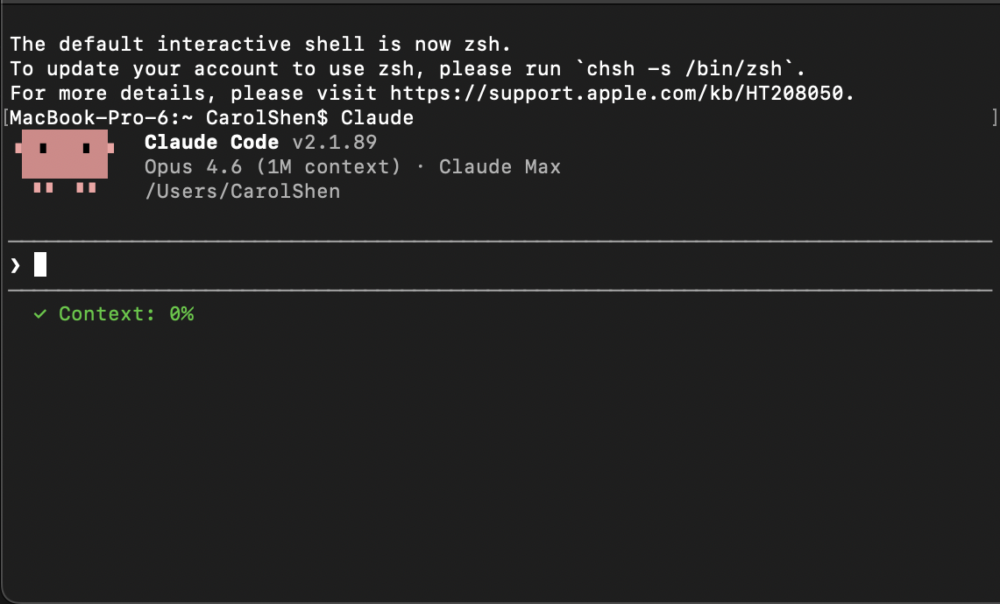

# claude-context-warning

Real-time context window usage indicator for [Claude Code](https://docs.anthropic.com/en/docs/claude-code).

Shows a color-coded percentage in your terminal status line so you know when to `/compact` before your session crashes.



## Why?

Claude Code (especially with Opus 1M context) can crash when the context window fills up. There's no built-in warning — it just auto-compacts or exits. This script gives you a persistent visual indicator so you can act before it's too late.

## What it looks like

```
✓ Context: 12%      ← green, you're fine
⚡ Context: 65%     ← yellow, keep an eye on it
⚠ Context: 85%      ← red, consider /compact
🔴 CONTEXT 96%      ← flashing red, do something NOW
```

After running `/compact` or `/clear`, the indicator updates automatically on the next response.

## Install

**One-liner:**

```bash
curl -fsSL https://raw.githubusercontent.com/cyberpunkbeatgeneration/claude-context-warning/main/install.sh | bash
```

**Manual:**

1. Download `context_warning.sh` to `~/.claude/`:

```bash
curl -fsSL https://raw.githubusercontent.com/cyberpunkbeatgeneration/claude-context-warning/main/context_warning.sh -o ~/.claude/context_warning.sh
chmod +x ~/.claude/context_warning.sh
```

2. Add to `~/.claude/settings.json`:

```json
{
  "statusLine": {
    "type": "command",
    "command": "/path/to/your/home/.claude/context_warning.sh"
  }
}
```

3. Restart Claude Code (or open a new session).

## Thresholds

| Usage | Color | Meaning |
|-------|-------|---------|
| < 60% | Green ✓ | Normal |
| 60-80% | Yellow ⚡ | Getting full, consider `/compact` soon |
| 80-95% | Red ⚠ | Almost full, `/compact` recommended |
| ≥ 95% | Flashing red 🔴 | Critical — `/compact` or `/clear` immediately |

## Customization

Edit the thresholds in `context_warning.sh` — they're just `if/elif` checks on the percentage value. Adjust to your preference.

## Requirements

- [Claude Code](https://docs.anthropic.com/en/docs/claude-code) (CLI, desktop app, or IDE extension)
- Python 3 (for JSON parsing — pre-installed on macOS/most Linux)
- Bash

## How it works

Claude Code's `statusLine` feature pipes a JSON object to your script after each assistant response. The JSON includes `context_window.used_percentage`. This script reads that value and outputs a colored string.

That's it. One `cat`, one `python3 -c`, one `echo`. No dependencies, no daemons, no complexity.

## License

MIT
